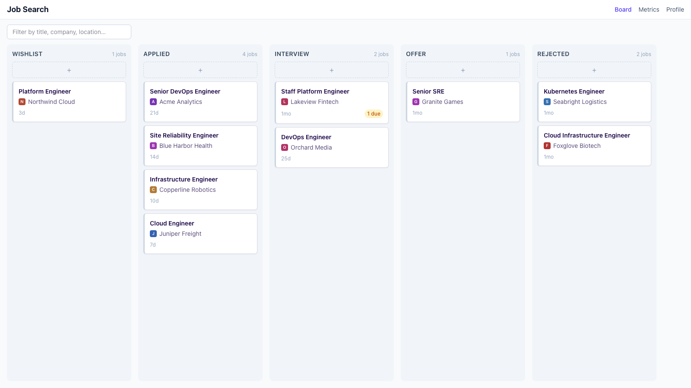

# JobTrack

Self-hosted job search tracker. A kanban pipeline for your applications
(Wishlist, Applied, Interview, Offer, Rejected) with per-job activities, notes,
contacts and documents, a metrics page, a Chrome extension for one-click job
capture and application autofill, and an MCP server so you can read and update
your board straight from an AI chat.

Everything runs locally: one Node process, one SQLite file, no accounts, no
cloud.



## Features

- **Board** — five-stage kanban with drag and drop, per-column quick add, a
  text filter, company logos, and hover actions (open post, delete) on every
  card. Handles hundreds of cards per column.
- **Job detail** — tabs for editable info (including how the job originated:
  applied, reachout, referral), activities with due dates and overdue
  highlighting, editable stage history, markdown notes, linked contacts,
  document uploads, and a company profile shared across that company's jobs.
- **Metrics** — applications per week, stage conversion rates, response rate,
  average days in stage, where jobs came from, and an interview-rounds funnel
  (screening / hiring manager / technical / final). Everything recomputes live
  from your data.
- **Chrome extension** — capture postings from LinkedIn, Greenhouse, Lever,
  Ashby, Workday, Indeed, or any page with JobPosting metadata via an in-page
  panel with review-before-save, then autofill application forms from your
  saved profile and resume.
- **MCP server** — 11 tools to add jobs, move cards, log and retag interview
  rounds, record sources, and pull metrics from a Claude (or any MCP) chat.
- **Importer** — bring your history over from a hosted tracker's CSV export,
  idempotently, with stage history preserved so metrics stay honest.

## Quick start

Requires Node 20+.

```sh
git clone https://github.com/LenarMas/job-board.git
cd job-board
npm install
npm run seed   # fictional demo data
npm run dev
```

Open http://localhost:3000. To start from your real data instead of the demo,
skip `npm run seed` and use the [importer](#importing-your-history).

### Docker

```sh
docker compose up --build
```

Same app on :3000, with `data/` and `uploads/` mounted as volumes.

## Where your data lives

| What | Where | In git? |
|---|---|---|
| Board database (SQLite) | `data/jobtrack.db` | No — gitignored |
| Uploaded documents and resume | `uploads/` | No — gitignored |
| Raw tracker exports for import | `migration/raw/` | No — gitignored |

Back up those two directories and you've backed up everything.

## Configuration

Defaults work out of the box; every knob is an environment variable:

| Variable | Default | Purpose |
|---|---|---|
| `PORT` | `3000` | Web app port (`PORT=4000 npm run dev`) |
| `JOBTRACK_DB` | `<repo>/data/jobtrack.db` | SQLite file path — point the app or MCP server at another database |
| `JOBTRACK_UPLOADS` | `<repo>/uploads` | Where uploaded files are stored |

Schema migrations are checked into `packages/core/drizzle/` and apply
automatically whenever the app or MCP server opens the database.

## Setting up each piece

### Chrome extension (capture + autofill)

```sh
npm run build -w @jobtrack/extension
```

Then `chrome://extensions` → enable **Developer mode** → **Load unpacked** →
select `packages/extension/dist`. Click the toolbar button on any job posting
to capture it; fill in your details and resume at
http://localhost:3000/profile to enable **Autofill application**. Full
walkthrough, supported sites, and how parsing works:
[packages/extension/README.md](packages/extension/README.md).

### MCP server (Claude integration)

```sh
npm run build -w @jobtrack/mcp
```

Add to Claude Desktop's `claude_desktop_config.json` (or `claude mcp add` for
Claude Code), with your absolute repo path:

```json
{
  "mcpServers": {
    "jobtrack": {
      "command": "node",
      "args": ["/absolute/path/to/job-board/packages/mcp/dist/index.js"]
    }
  }
}
```

Restart the client and ask "what's on my job board?". Tool reference and a
smoke-test checklist: [packages/mcp/README.md](packages/mcp/README.md).

### Importing your history

Drop your old tracker's CSV export into `migration/raw/`, preview with
`npm run import -- --dry-run`, then `npm run import`. Re-running is safe
(idempotent upserts). Details: [migration/README.md](migration/README.md).

## Commands

| Command | What it does |
|---|---|
| `npm run dev` | Start the app on :3000 |
| `npm run build` / `npm run start` | Production build / serve |
| `npm run seed` | Reset the database with fictional demo data (refuses to wipe imported data without `--force`) |
| `npm run import -- --dry-run` | Preview a CSV import from `migration/raw/` |
| `npm run import` | Run the import |
| `npm run build -w @jobtrack/mcp` | Build the MCP server to `packages/mcp/dist` |
| `npm run build -w @jobtrack/extension` | Build the extension to `packages/extension/dist` |
| `npm run lint` / `typecheck` / `test` | Checks across all workspaces |

## Layout

```
apps/web            Next.js app (board UI, API routes)
packages/core       schema, migrations, db client, service layer, seed
packages/mcp        MCP server (stdio)
packages/extension  Chrome extension (job capture + application autofill)
migration/          CSV importer (raw exports go in migration/raw/, gitignored)
```

The web app and the MCP server share the same service layer and database, so
a change made from a chat shows up on the board on refresh, and vice versa.

## License

MIT
